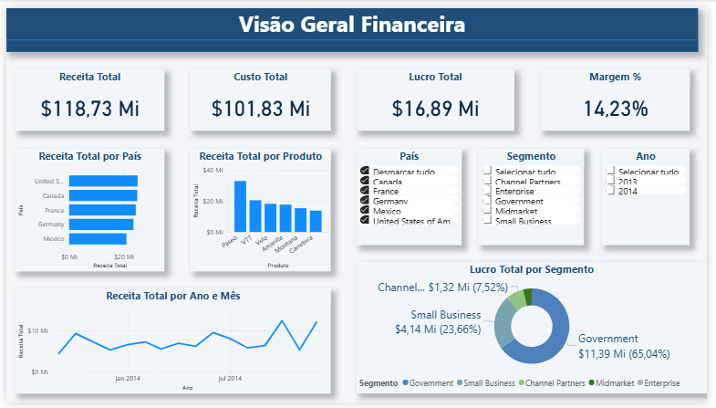
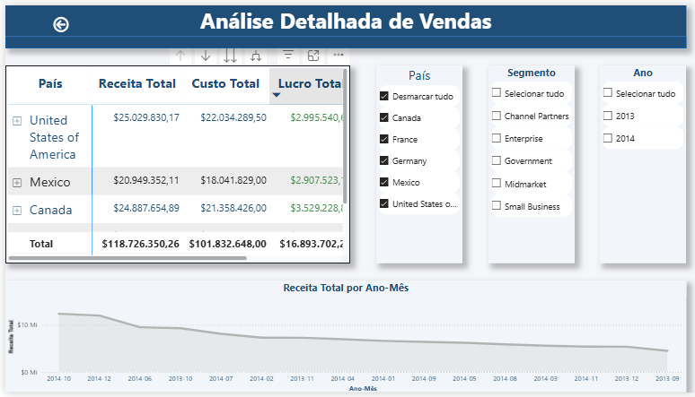

# 📊 Relatório Financeiro – Power BI

Projeto desenvolvido como parte do desafio da DIO para a formação Power BI Analyst.

## 🧠 Objetivo
Criar um relatório financeiro interativo com base no dataset Financials, aplicando boas práticas de visualização de dados, segmentação e navegação entre páginas.

## 📁 Base de Dados
Dataset disponibilizado pela DIO:
https://github.com/julianazanelatto/power_bi_analyst

## 📈 Estrutura do Relatório

### Página 1 – Visão Geral Financeira
- Indicadores de Receita, Custo, Lucro e Margem
- Análises por País, Produto e Segmento
- Segmentadores interativos

### Página 2 – Análise Detalhada
- Matriz com detalhamento por Produto e País
- Evolução da Receita ao longo do tempo
- Segmentadores reaproveitados
- Botão de navegação entre páginas

## 🛠️ Ferramentas Utilizadas
- Power BI Desktop

## 👨‍💻 Autor

Thiago Sperate 😎  
Analista de Dados 📊  

📎 [LinkedIn](https://www.linkedin.com/in/thiagosperate/)  
📁 [Portfólio](https://github.com/ThSperate)
